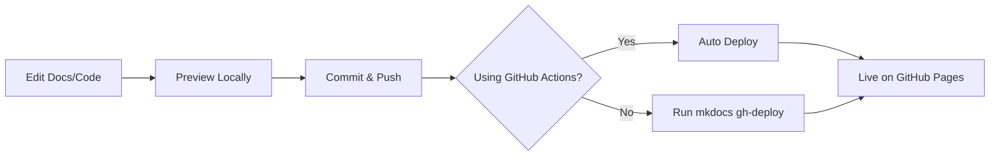

# GitHub Pages Deployment Guide

Deploy your documentation to GitHub Pages for free hosting.

## 🚀 Quick Deploy (Automatic)

```bash
# One-command deployment
mkdocs gh-deploy
```

That's it! Your docs will be live at:
```
https://<username>.github.io/identifiability-guard/
```

## 📋 Step-by-Step Setup

### 1. Prerequisites

```bash
# Install documentation dependencies
uv pip install -e ".[docs]"

# Verify mkdocs is installed
mkdocs --version
```

### 2. Update Repository URLs

Edit `mkdocs.yml` and replace placeholders:

```yaml
repo_url: https://github.com/YOUR_USERNAME/identifiability-guard
repo_name: identifiability-guard
```

### 3. Initial Deployment

```bash
# Build and deploy
mkdocs gh-deploy

# This will:
# 1. Build the documentation site
# 2. Create/update the gh-pages branch
# 3. Push to GitHub
# 4. Enable GitHub Pages automatically
```

### 4. Enable GitHub Pages (if not auto-enabled)

1. Go to your repository on GitHub
2. Click **Settings** → **Pages**
3. Under **Source**, select:
   - Branch: `gh-pages`
   - Folder: `/ (root)`
4. Click **Save**

### 5. Verify Deployment

Visit your docs at:
```
https://<username>.github.io/identifiability-guard/
```

Wait 1-2 minutes for the first deployment to complete.

## 🔄 Continuous Deployment with GitHub Actions

For automatic deployment on every push to main:

### Create Workflow File

```bash
mkdir -p .github/workflows
```

Create `.github/workflows/deploy-docs.yml`:

```yaml
name: Deploy Documentation

on:
  push:
    branches:
      - main
  workflow_dispatch:

permissions:
  contents: write

jobs:
  deploy:
    runs-on: ubuntu-latest
    steps:
      - uses: actions/checkout@v4
        with:
          fetch-depth: 0

      - name: Set up Python
        uses: actions/setup-python@v5
        with:
          python-version: '3.11'

      - name: Install uv
        run: |
          curl -LsSf https://astral.sh/uv/install.sh | sh
          echo "$HOME/.cargo/bin" >> $GITHUB_PATH

      - name: Install dependencies
        run: |
          uv pip install --system -e ".[docs]"

      - name: Build and deploy docs
        run: |
          mkdocs gh-deploy --force
```

**Now docs auto-deploy on every push to `main`!** 🎉

## ⚙️ Advanced Configuration

### Custom Domain

1. Add a file `docs/CNAME` with your domain:
   ```
   docs.yourdomain.com
   ```

2. Configure DNS with your domain provider:
   ```
   Type: CNAME
   Name: docs
   Value: <username>.github.io
   ```

3. In GitHub Settings → Pages, enter your custom domain

### Build Optimization

Add to `mkdocs.yml` for faster builds:

```yaml
plugins:
  - search
  - mkdocstrings:
      handlers:
        python:
          options:
            # ... existing options ...
            cache: true  # Enable caching
```

### Analytics

Add Google Analytics to `mkdocs.yml`:

```yaml
extra:
  analytics:
    provider: google
    property: G-XXXXXXXXXX  # Your GA4 ID
```

## 🛠️ Manual Build & Deploy

If you prefer manual control:

```bash
# 1. Build locally
mkdocs build

# 2. Preview the built site
cd site && python -m http.server 8000

# 3. Manually deploy
mkdocs gh-deploy
```

## 📝 Workflow Summary

### Development Workflow

```bash
# 1. Make changes to docs or code
vim docs/metrics.md
vim src/identifiability_guard/metrics/mcc.py

# 2. Preview locally
mkdocs serve
# Check http://127.0.0.1:8000

# 3. Commit changes
git add docs/ src/
git commit -m "Update metrics documentation"

# 4. Deploy (automatic if using GitHub Actions)
git push origin main

# Or deploy manually
mkdocs gh-deploy
```

### Update Cycle



## 🔍 Troubleshooting

### Issue: Build Fails

```bash
# Check for errors
mkdocs build --verbose

# Common fixes:
# 1. Ensure all files are committed
git status

# 2. Reinstall dependencies
uv pip install -e ".[docs]"

# 3. Clear cache
rm -rf site/
mkdocs build
```

### Issue: 404 Page Not Found

1. Check GitHub Pages is enabled in repository settings
2. Verify `gh-pages` branch exists
3. Wait 2-3 minutes for deployment
4. Check repository visibility (public/private)

### Issue: Images/Assets Not Loading

Ensure assets are in `docs/` directory:
```
docs/
├── images/
│   └── logo.png
├── stylesheets/
│   └── extra.css
└── ...
```

Reference in markdown:
```markdown

```

### Issue: Math Not Rendering

Check `extra_javascript` in `mkdocs.yml`:
```yaml
extra_javascript:
  - https://polyfill.io/v3/polyfill.min.js?features=es6
  - https://cdn.jsdelivr.net/npm/mathjax@3/es5/tex-mml-chtml.js
```

## 🎨 Theme Customization

Your docs use a **bomb color theme** with:
- **Light mode**: Deep purple primary, pink accents
- **Dark mode**: Purple primary, cyan accents
- Gradient effects on links and code blocks
- Custom fonts: Inter (text), JetBrains Mono (code)

To customize further, edit:
- `mkdocs.yml` - Theme colors and features
- `docs/stylesheets/extra.css` - Custom CSS

## 📊 Monitoring

After deployment:
- Check GitHub Actions tab for build logs
- Monitor visitor stats in Google Analytics (if configured)
- Review search queries in MkDocs search analytics

## 🔐 Security

GitHub Pages is secure by default:
- ✅ Free HTTPS with SSL certificates
- ✅ DDoS protection via GitHub infrastructure
- ✅ Automatic security updates
- ✅ Private repo support (with GitHub Pro)

## 🚀 Performance

Optimize load times:
1. **Enable caching** in plugin configs
2. **Minify assets** (automatic with mkdocs build)
3. **Use CDN** for external resources (already configured)
4. **Lazy load images** in markdown

## 📚 Resources

- [MkDocs Documentation](https://www.mkdocs.org/)
- [Material Theme Docs](https://squidfunk.github.io/mkdocs-material/)
- [GitHub Pages Docs](https://docs.github.com/en/pages)
- [GitHub Actions Marketplace](https://github.com/marketplace?type=actions)

## ✅ Deployment Checklist

Before deploying:
- [ ] All code has docstrings
- [ ] Manual docs are up to date
- [ ] `mkdocs serve` works locally
- [ ] Repository URL updated in `mkdocs.yml`
- [ ] Custom domain configured (if applicable)
- [ ] Analytics ID added (optional)
- [ ] GitHub Actions workflow added (optional)

Deploy:
```bash
mkdocs gh-deploy
```

Verify:
- [ ] Visit `https://<username>.github.io/identifiability-guard/`
- [ ] Check all pages load correctly
- [ ] Test search functionality
- [ ] Verify dark/light mode toggle
- [ ] Check API reference auto-generated correctly
